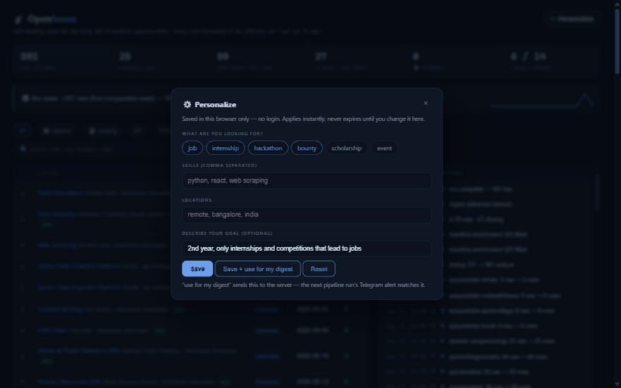
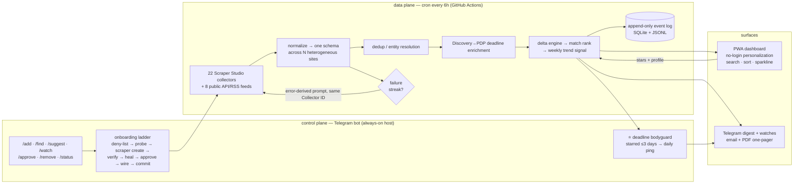

# OpenSense — Spider-sense for opportunities

> A self-healing radar for the long tail of student opportunities in India.
> Built for [Into the Scrape-Verse](https://www.wemakedevs.org/hackathons/scrape-verse) (WeMakeDevs × Bright Data, Aug 17–23, 2026).



Aggregators only index the platforms (LinkedIn, Internshala). The actual long tail — startup career
pages, scholarship foundations, college fest pages, community hackathon listings — is unindexed,
heterogeneous, and changes layout constantly. OpenSense covers that class with **Bright Data
Scraper Studio** collectors that **heal themselves** when pages change, unifies the chaos into one
schema, and delivers a matched daily digest with deadline countdowns.

**Every run, row, failure, heal, and alert is an append-only event.** The dashboard isn't "latest
JSON" — it's a replayable timeline where every number traces to the exact collector run that
produced it.

**Live status (2026-08-23):** **22 live Scraper Studio collectors + 8 public API/RSS feeds** ·
**591 unified listings across all six kinds** (377 jobs · 69 scholarships · 53 hackathons ·
52 internships · 26 events · 14 bounties) — a meta-aggregator: the platforms students already
use (Internshala, Shine, Freshersworld, Buddy4Study, WeMakeScholars, DrivenData, Hasgeek,
Unstop, Devpost, HackerEarth, Devfolio, MLH, Techgig, the WeMakeDevs board itself…) **plus**
the long-tail pages nobody indexes, in one schema · **6 real self-heals in the event
timeline** (Freshworks ×2, detail-collector countdown truncation, Kaggle, Foundit selector
timeout, Devpost empty-cards) · **auto-heal loop** (failure-streak → error-derived prompt →
heal → approve → same Collector ID) · **Discovery→PDP deadline enrichment** with
relative-countdown parsing · **no-login personalization** (browser-persistent profile +
free-text goal parser + "win this → job" pathway badges) · installable **PWA** with instant
search, deadline/newest sort, live-updating stats, a cross-source trend sparkline, starred
watchlist and per-listing lineage · **weekly trend signal** (cross-source week-over-week —
the line no single-site aggregator can draw) · **deadline bodyguard** (starred listings
closing ≤3 days ping daily until they pass) · **source health scores** (success rate over
the last 20 runs per source) · **114 tests green in CI** · benched sources carry written
post-mortems (Zomato, Swiggy, Kaggle, Sitare, Foundit — swap-in is a one-line config change).

## How Scraper Studio is used (the four commands + everything after)

```
bdata scraper create   → 22 custom collectors live (Discovery/PDP types), no pre-built scrapers
bdata scraper run      → verification + the CLI path
bdata scraper heal     → manual (demo) + AUTO: failure-streak detection triggers heals,
                         approved, Collector ID unchanged — guardrails in pipeline/heal.py
bdata scraper approve  → guarded approval; auto-approve flag reserved for CI
POST /dca/trigger      → every scheduled run: Collector ID as the production API
                         (contract verified live: trigger → poll /dca/dataset → rows)
```

Supplementary: RemoteOK / Remotive / WorkingNomads / WeWorkRemotely / YouTube-channel RSS
feeds run inside every pipeline pass (`pipeline/api_sources.py`, event-logged with
`transport=api`) — public APIs are rules-permitted; Scraper Studio collectors remain the core.

## Control plane — the radar grows new senses on command

A dependency-free Telegram bot (`python -m pipeline bot`) turns the whole lifecycle into a
text message: `/add <url> [kind]` runs deny-list (LinkedIn/gov/login-walls are refused with
reasons — compliance is a feature) → probes → `scraper create` → verify → **heal-until-good**
(two vetting cycles) → auto-wired into sources.yaml → git commit → verdict reply. Added
sources go live from the next cron run, wherever it executes.

It's an assistant, not just an admin panel: `/find ml internship bangalore` searches the
live radar instantly; `/suggest [kind]` makes the radar **propose its own expansion** — the
next un-attempted research candidates, each with one-tap Add / Skip buttons that run the
full onboarding ladder. `/sources` shows per-source health (success rate over the last 20
runs), `/status` the fleet line. Starred listings closing within 3 days get a daily
**deadline bodyguard** ping until the window passes — fired from both the bot loop and the
cron, deduped on disk so it never double-pings. `/watch <keyword>` pings on new matches
(fired from CI), heal approvals happen from the phone, and the email digest carries a PDF
one-pager. Data plane (GitHub Actions) and control plane (bot host) share nothing but the
repo.

**AI-use disclosure:** a coding agent (ZCode, on GLM) assisted with this repo and drove the
CLI commands; the pipeline architecture, normalize/dedup/delta logic, guardrails, and every
heal prompt were designed and reviewed by the author, who can explain each module line by
line — see `tests/` for the behavioral contract. Digests are rules-based; an *optional*
LLM narration line exists but is env-gated (`NARRATE_API_KEY`) and off by default.

## Architecture



## How this hits the judging criteria

| Criterion | Where it lives |
|---|---|
| Potential impact | Judges are the audience: students/junior devs. Real pain, real users. |
| Creativity | Not a price tracker. Long-tail opportunity class + event-sourced pipeline. |
| Technical excellence | Schema unification across ~20 heterogeneous layouts, guarded entity resolution, delta engine, Discovery→PDP enrichment, no-login personalization with a deterministic prompt parser, cross-source trend signal, 114 tests. |
| Use of Scraper Studio | Full lifecycle: `create → run → heal(auto) → approve` + trigger API in CI + batch PDP enrichment. |
| Reliability / self-healing | Auto-heal loop with event-log guardrails; append-only timeline; partial-failure quarantine; per-source health scores; quality gates. |
| Presentation | Installable PWA with instant search + sparklines, starred watchlist, lineage modal, GIF demo above the fold. |

## Quickstart

Runs anywhere Python does — developed on Windows, in production on Linux (GitHub Actions).
The repo ships with the latest run's committed data, so the dashboard is real from the
first `serve` — no accounts, no scraping, no setup:

```bash
git clone https://github.com/ladiesmans217/OpenSense && cd OpenSense
pip install -r requirements.txt          # Python 3.11+ (tested on 3.11, 3.12, 3.14)

# ── the 60-second tour — no accounts needed ──────────────────────────────
python -m pytest -q                      # 114 tests
python -m pipeline serve                 # dashboard → http://localhost:8000/dashboard/
python -m pipeline run --dry             # pipeline smoke test (in-memory, writes nothing)

# ── the live radar — needs a Bright Data token ───────────────────────────
cp .env.example .env                     # add BRIGHTDATA_API_TOKEN (docs/SETUP.md, 5 min)
python -m pipeline run                   # 22 collectors + 8 feeds → normalize → … → digest

# ── the control plane — optional, from your phone ────────────────────────
# TELEGRAM_BOT_TOKEN + TELEGRAM_CHAT_ID + TELEGRAM_ADMIN_IDS in .env
python -m pipeline bot                   # /add /find /suggest /watch /status …
```

Adding a source never requires editing YAML by hand: message the bot `/add <url> [kind]`
and it runs the whole ladder — or use the CLI directly and paste the id into
`config/sources.yaml`:

```bash
npx -p @brightdata/cli bdata scraper create <url> "title, deadline, url, …"
npx -p @brightdata/cli bdata scraper run <COLLECTOR_ID> <url> --pretty
```

Full setup — Bright Data account, tokens, CI secrets, the heal-demo procedure — is in
[`docs/SETUP.md`](docs/SETUP.md).

## Repo map

```
config/sources.yaml     source registry (kind, type, seed URL, field map, collector_id)
config/profile.yaml     what you're looking for (skills/roles/locations)
pipeline/               trigger → normalize → dedup → diff → match → digest, event log
pipeline/trends.py      weekly signal, health scores, daily series (pure)
pipeline/bodyguard.py   starred-deadline pings (bot loop + cron, deduped on disk)
pipeline/bot.py         Telegram control plane: /add /find /suggest /watch /approve…
pipeline/narrate.py     optional env-gated LLM narration (off by default)
dashboard/index.html    timeline + listings UI (vanilla JS, no build step)
demo-site/              hostable page to demo the self-heal (break a class, film the repair)
.github/workflows/      cron schedule + manual dispatch, commits data/ back
n8n/                    optional visual delivery layer (docker-compose)
docs/SETUP.md           full setup: bdata, tokens, CI, heal demo procedure
data/                   latest.json, events.jsonl, state.json (committed = visible history)
```

Public data only. No login-walled, paywalled, or personal data; no government sites. See
`docs/SETUP.md` for the pre-built-library check (Step 0) before adding any source.
